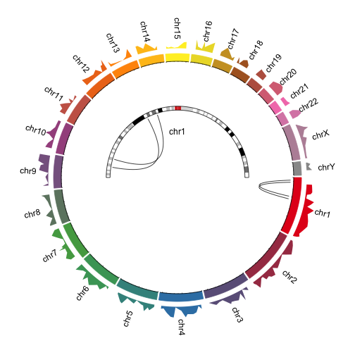

```r
library(circlize)
set.seed(12345)
```

## Figure 1A


```
## Warning in circos.genomicLines(region, value, area = TRUE, area.baseline = 0, : `area.baseline` is deprecated, please use `baseline` instead.
```

```
## Warning in circos.genomicLines(region, -value, area = TRUE, area.baseline = 0, : `area.baseline` is deprecated, please use `baseline` instead.
```

```
## Warning in circos.genomicLines(region, value, area = TRUE, area.baseline = 0, : `area.baseline` is deprecated, please use `baseline` instead.
```

```
## Warning in circos.genomicLines(region, -value, area = TRUE, area.baseline = 0, : `area.baseline` is deprecated, please use `baseline` instead.
```

```
## Warning in circos.genomicLines(region, value, area = TRUE, area.baseline = 0, : `area.baseline` is deprecated, please use `baseline` instead.
```

```
## Warning in circos.genomicLines(region, -value, area = TRUE, area.baseline = 0, : `area.baseline` is deprecated, please use `baseline` instead.
```

```
## Warning in circos.genomicLines(region, value, area = TRUE, area.baseline = 0, : `area.baseline` is deprecated, please use `baseline` instead.
```

```
## Warning in circos.genomicLines(region, -value, area = TRUE, area.baseline = 0, : `area.baseline` is deprecated, please use `baseline` instead.
```

```
## Warning in circos.genomicLines(region, value, area = TRUE, area.baseline = 0, : `area.baseline` is deprecated, please use `baseline` instead.
```

```
## Warning in circos.genomicLines(region, -value, area = TRUE, area.baseline = 0, : `area.baseline` is deprecated, please use `baseline` instead.
```

```
## Warning in circos.genomicLines(region, value, area = TRUE, area.baseline = 0, : `area.baseline` is deprecated, please use `baseline` instead.
```

```
## Warning in circos.genomicLines(region, -value, area = TRUE, area.baseline = 0, : `area.baseline` is deprecated, please use `baseline` instead.
```

```
## Warning in circos.genomicLines(region, value, area = TRUE, area.baseline = 0, : `area.baseline` is deprecated, please use `baseline` instead.
```

```
## Warning in circos.genomicLines(region, -value, area = TRUE, area.baseline = 0, : `area.baseline` is deprecated, please use `baseline` instead.
```

```
## Warning in circos.genomicLines(region, value, area = TRUE, area.baseline = 0, : `area.baseline` is deprecated, please use `baseline` instead.
```

```
## Warning in circos.genomicLines(region, -value, area = TRUE, area.baseline = 0, : `area.baseline` is deprecated, please use `baseline` instead.
```

```
## Warning in circos.genomicLines(region, value, area = TRUE, area.baseline = 0, : `area.baseline` is deprecated, please use `baseline` instead.
```

```
## Warning in circos.genomicLines(region, -value, area = TRUE, area.baseline = 0, : `area.baseline` is deprecated, please use `baseline` instead.
```

```
## Warning in circos.genomicLines(region, value, area = TRUE, area.baseline = 0, : `area.baseline` is deprecated, please use `baseline` instead.
```

```
## Warning in circos.genomicLines(region, -value, area = TRUE, area.baseline = 0, : `area.baseline` is deprecated, please use `baseline` instead.
```

```
## Warning in circos.genomicLines(region, value, area = TRUE, area.baseline = 0, : `area.baseline` is deprecated, please use `baseline` instead.
```

```
## Warning in circos.genomicLines(region, -value, area = TRUE, area.baseline = 0, : `area.baseline` is deprecated, please use `baseline` instead.
```

```
## Warning in circos.genomicLines(region, value, area = TRUE, area.baseline = 0, : `area.baseline` is deprecated, please use `baseline` instead.
```

```
## Warning in circos.genomicLines(region, -value, area = TRUE, area.baseline = 0, : `area.baseline` is deprecated, please use `baseline` instead.
```

```
## Warning in circos.genomicLines(region, value, area = TRUE, area.baseline = 0, : `area.baseline` is deprecated, please use `baseline` instead.
```

```
## Warning in circos.genomicLines(region, -value, area = TRUE, area.baseline = 0, : `area.baseline` is deprecated, please use `baseline` instead.
```

```
## Warning in circos.genomicLines(region, value, area = TRUE, area.baseline = 0, : `area.baseline` is deprecated, please use `baseline` instead.
```

```
## Warning in circos.genomicLines(region, -value, area = TRUE, area.baseline = 0, : `area.baseline` is deprecated, please use `baseline` instead.
```

```
## Warning in circos.genomicLines(region, value, area = TRUE, area.baseline = 0, : `area.baseline` is deprecated, please use `baseline` instead.
```

```
## Warning in circos.genomicLines(region, -value, area = TRUE, area.baseline = 0, : `area.baseline` is deprecated, please use `baseline` instead.
```

```
## Warning in circos.genomicLines(region, value, area = TRUE, area.baseline = 0, : `area.baseline` is deprecated, please use `baseline` instead.
```

```
## Warning in circos.genomicLines(region, -value, area = TRUE, area.baseline = 0, : `area.baseline` is deprecated, please use `baseline` instead.
```

```
## Warning in circos.genomicLines(region, value, area = TRUE, area.baseline = 0, : `area.baseline` is deprecated, please use `baseline` instead.
```

```
## Warning in circos.genomicLines(region, -value, area = TRUE, area.baseline = 0, : `area.baseline` is deprecated, please use `baseline` instead.
```

```
## Warning in circos.genomicLines(region, value, area = TRUE, area.baseline = 0, : `area.baseline` is deprecated, please use `baseline` instead.
```

```
## Warning in circos.genomicLines(region, -value, area = TRUE, area.baseline = 0, : `area.baseline` is deprecated, please use `baseline` instead.
```

```
## Warning in circos.genomicLines(region, value, area = TRUE, area.baseline = 0, : `area.baseline` is deprecated, please use `baseline` instead.
```

```
## Warning in circos.genomicLines(region, -value, area = TRUE, area.baseline = 0, : `area.baseline` is deprecated, please use `baseline` instead.
```

```
## Warning in circos.genomicLines(region, value, area = TRUE, area.baseline = 0, : `area.baseline` is deprecated, please use `baseline` instead.
```

```
## Warning in circos.genomicLines(region, -value, area = TRUE, area.baseline = 0, : `area.baseline` is deprecated, please use `baseline` instead.
```

```
## Warning in circos.genomicLines(region, value, area = TRUE, area.baseline = 0, : `area.baseline` is deprecated, please use `baseline` instead.
```

```
## Warning in circos.genomicLines(region, -value, area = TRUE, area.baseline = 0, : `area.baseline` is deprecated, please use `baseline` instead.
```

```
## Warning in circos.genomicLines(region, value, area = TRUE, area.baseline = 0, : `area.baseline` is deprecated, please use `baseline` instead.
```

```
## Warning in circos.genomicLines(region, -value, area = TRUE, area.baseline = 0, : `area.baseline` is deprecated, please use `baseline` instead.
```

```
## Warning in circos.genomicLines(region, value, area = TRUE, area.baseline = 0, : `area.baseline` is deprecated, please use `baseline` instead.
```

```
## Warning in circos.genomicLines(region, -value, area = TRUE, area.baseline = 0, : `area.baseline` is deprecated, please use `baseline` instead.
```

```
## Warning in circos.genomicLines(region, value, area = TRUE, area.baseline = 0, : `area.baseline` is deprecated, please use `baseline` instead.
```

```
## Warning in circos.genomicLines(region, -value, area = TRUE, area.baseline = 0, : `area.baseline` is deprecated, please use `baseline` instead.
```


## Figure 1B


```
## Warning in circos.text(mean(xlim), 0.5, labels = chr, direction = direction): `direction` is deprecated, please use `facing` instead.

## Warning in circos.text(mean(xlim), 0.5, labels = chr, direction = direction): `direction` is deprecated, please use `facing` instead.

## Warning in circos.text(mean(xlim), 0.5, labels = chr, direction = direction): `direction` is deprecated, please use `facing` instead.

## Warning in circos.text(mean(xlim), 0.5, labels = chr, direction = direction): `direction` is deprecated, please use `facing` instead.

## Warning in circos.text(mean(xlim), 0.5, labels = chr, direction = direction): `direction` is deprecated, please use `facing` instead.

## Warning in circos.text(mean(xlim), 0.5, labels = chr, direction = direction): `direction` is deprecated, please use `facing` instead.

## Warning in circos.text(mean(xlim), 0.5, labels = chr, direction = direction): `direction` is deprecated, please use `facing` instead.

## Warning in circos.text(mean(xlim), 0.5, labels = chr, direction = direction): `direction` is deprecated, please use `facing` instead.

## Warning in circos.text(mean(xlim), 0.5, labels = chr, direction = direction): `direction` is deprecated, please use `facing` instead.

## Warning in circos.text(mean(xlim), 0.5, labels = chr, direction = direction): `direction` is deprecated, please use `facing` instead.

## Warning in circos.text(mean(xlim), 0.5, labels = chr, direction = direction): `direction` is deprecated, please use `facing` instead.

## Warning in circos.text(mean(xlim), 0.5, labels = chr, direction = direction): `direction` is deprecated, please use `facing` instead.

## Warning in circos.text(mean(xlim), 0.5, labels = chr, direction = direction): `direction` is deprecated, please use `facing` instead.

## Warning in circos.text(mean(xlim), 0.5, labels = chr, direction = direction): `direction` is deprecated, please use `facing` instead.

## Warning in circos.text(mean(xlim), 0.5, labels = chr, direction = direction): `direction` is deprecated, please use `facing` instead.

## Warning in circos.text(mean(xlim), 0.5, labels = chr, direction = direction): `direction` is deprecated, please use `facing` instead.

## Warning in circos.text(mean(xlim), 0.5, labels = chr, direction = direction): `direction` is deprecated, please use `facing` instead.

## Warning in circos.text(mean(xlim), 0.5, labels = chr, direction = direction): `direction` is deprecated, please use `facing` instead.

## Warning in circos.text(mean(xlim), 0.5, labels = chr, direction = direction): `direction` is deprecated, please use `facing` instead.

## Warning in circos.text(mean(xlim), 0.5, labels = chr, direction = direction): `direction` is deprecated, please use `facing` instead.

## Warning in circos.text(mean(xlim), 0.5, labels = chr, direction = direction): `direction` is deprecated, please use `facing` instead.

## Warning in circos.text(mean(xlim), 0.5, labels = chr, direction = direction): `direction` is deprecated, please use `facing` instead.

## Warning in circos.text(mean(xlim), 0.5, labels = chr, direction = direction): `direction` is deprecated, please use `facing` instead.

## Warning in circos.text(mean(xlim), 0.5, labels = chr, direction = direction): `direction` is deprecated, please use `facing` instead.
```

```
## Warning in circos.genomicLines(region, value, area = TRUE, border = NA, : `area.baseline` is deprecated, please use `baseline` instead.

## Warning in circos.genomicLines(region, value, area = TRUE, border = NA, : `area.baseline` is deprecated, please use `baseline` instead.

## Warning in circos.genomicLines(region, value, area = TRUE, border = NA, : `area.baseline` is deprecated, please use `baseline` instead.

## Warning in circos.genomicLines(region, value, area = TRUE, border = NA, : `area.baseline` is deprecated, please use `baseline` instead.

## Warning in circos.genomicLines(region, value, area = TRUE, border = NA, : `area.baseline` is deprecated, please use `baseline` instead.

## Warning in circos.genomicLines(region, value, area = TRUE, border = NA, : `area.baseline` is deprecated, please use `baseline` instead.

## Warning in circos.genomicLines(region, value, area = TRUE, border = NA, : `area.baseline` is deprecated, please use `baseline` instead.

## Warning in circos.genomicLines(region, value, area = TRUE, border = NA, : `area.baseline` is deprecated, please use `baseline` instead.

## Warning in circos.genomicLines(region, value, area = TRUE, border = NA, : `area.baseline` is deprecated, please use `baseline` instead.

## Warning in circos.genomicLines(region, value, area = TRUE, border = NA, : `area.baseline` is deprecated, please use `baseline` instead.

## Warning in circos.genomicLines(region, value, area = TRUE, border = NA, : `area.baseline` is deprecated, please use `baseline` instead.

## Warning in circos.genomicLines(region, value, area = TRUE, border = NA, : `area.baseline` is deprecated, please use `baseline` instead.

## Warning in circos.genomicLines(region, value, area = TRUE, border = NA, : `area.baseline` is deprecated, please use `baseline` instead.

## Warning in circos.genomicLines(region, value, area = TRUE, border = NA, : `area.baseline` is deprecated, please use `baseline` instead.

## Warning in circos.genomicLines(region, value, area = TRUE, border = NA, : `area.baseline` is deprecated, please use `baseline` instead.

## Warning in circos.genomicLines(region, value, area = TRUE, border = NA, : `area.baseline` is deprecated, please use `baseline` instead.

## Warning in circos.genomicLines(region, value, area = TRUE, border = NA, : `area.baseline` is deprecated, please use `baseline` instead.

## Warning in circos.genomicLines(region, value, area = TRUE, border = NA, : `area.baseline` is deprecated, please use `baseline` instead.

## Warning in circos.genomicLines(region, value, area = TRUE, border = NA, : `area.baseline` is deprecated, please use `baseline` instead.

## Warning in circos.genomicLines(region, value, area = TRUE, border = NA, : `area.baseline` is deprecated, please use `baseline` instead.

## Warning in circos.genomicLines(region, value, area = TRUE, border = NA, : `area.baseline` is deprecated, please use `baseline` instead.

## Warning in circos.genomicLines(region, value, area = TRUE, border = NA, : `area.baseline` is deprecated, please use `baseline` instead.

## Warning in circos.genomicLines(region, value, area = TRUE, border = NA, : `area.baseline` is deprecated, please use `baseline` instead.

## Warning in circos.genomicLines(region, value, area = TRUE, border = NA, : `area.baseline` is deprecated, please use `baseline` instead.
```

```
## Error in circos.link(region1[i, 1], point1, region2[i, 1], point2, rou1 = rou1[i], : unused argument (top.ratio = 0.8)
```



```
## Error in circos.link(region1[i, 1], point1, region2[i, 1], point2, rou1 = rou1[i], : unused argument (top.ratio = 0.8)
```

## Figure 1C


## Figure 1D


## Figure 1E


## Figure 1F


## Session info


```r
sessionInfo()
```

```
## R version 3.2.3 (2015-12-10)
## Platform: x86_64-apple-darwin13.4.0 (64-bit)
## Running under: OS X 10.11.6 (El Capitan)
## 
## locale:
## [1] C/en_US.UTF-8/C/C/C/C
## 
## attached base packages:
## [1] stats     graphics  grDevices utils     datasets  methods   base     
## 
## other attached packages:
## [1] markdown_0.7.7 circlize_0.3.9 rmarkdown_1.0  knitr_1.14    
## [5] colorout_1.1-2
## 
## loaded via a namespace (and not attached):
##  [1] Rcpp_0.12.6          digest_0.6.10        mime_0.5            
##  [4] grid_3.2.3           formatR_1.4          magrittr_1.5        
##  [7] evaluate_0.9         stringi_1.1.1        GlobalOptions_0.0.10
## [10] tools_3.2.3          stringr_1.1.0        colorspace_1.2-6    
## [13] shape_1.4.2          htmltools_0.3.5
```
